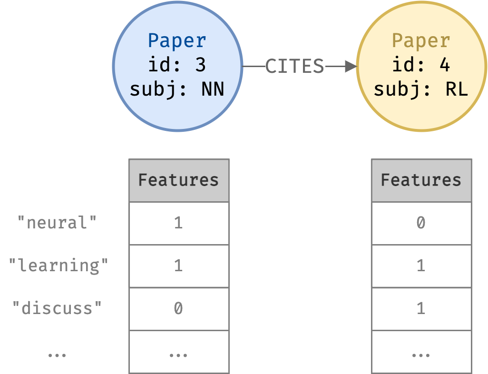

# neo4j-demos
This repo contains notebooks demonstrating and visualising graph data science and ML using [Neo4j](https://neo4j.com/) and [Graph Data Science](https://neo4j.com/docs/graph-data-science/current/introduction/) with the Northwind and Cora datasets.

## Contents

### Cora

This demo compares classification using a tabular dataset vs using a graph dataset. Using Neo4j and the Graph Data Science libraries, we show that modelling the data using a graph allows us to achieve better classification accuracy!

The problem studied is classifying a dataset of academic papers into categories using the [Cora dataset](https://paperswithcode.com/dataset/cora). Read the full tutorial here: ["Comparing ML using tabular vs graph data models with the Cora dataset"](https://andrewwango.github.io/neo4j-demos/rendered/cora/demo.html).

    

### Northwind

Here we show how querying a customer-product type of dataset may be easier with a graph data model vs tabular data model. This shows query commands using the [Cypher language](https://neo4j.com/docs/getting-started/current/cypher-intro/) and their equivalents in SQL. We use the [Northwind dataset](https://guides.neo4j.com/northwind/index.html) of customers, products, suppliers and orders.

### Rendered

Rendered Quarto blog for Cora demo.